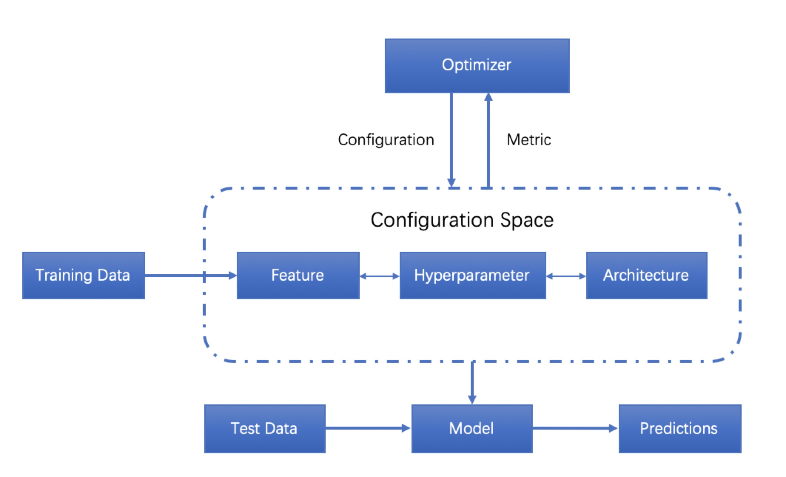
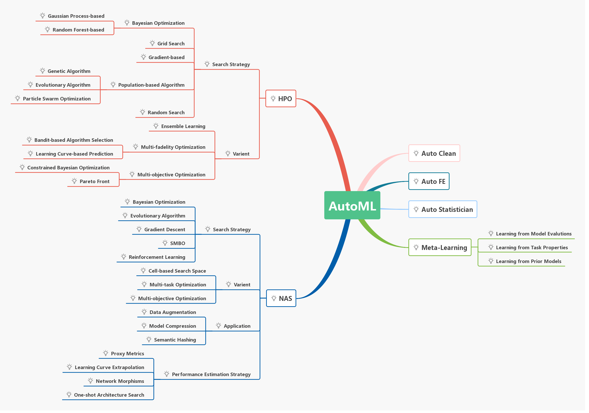

# The World of AutoML AutoKeras HPO

This repo **AutoML-AutoKeras-HPO** is a curated list of *automated machine learning* tehcniques and projects. **Star** this repository, and then you can keep abreast of the latest developments of this booming research field which I would keep updating it. Thanks to all the people who made contributions to this project. Join us and you are welcome to be a contributor.

# What is AutoML?
*Automated Machine Learning* (AutoML) provides methods and processes to make Machine Learning available for non-Machine Learning experts, to improve efficiency of Machine Learning and to accelerate research on Machine Learning.

Machine Learning (ML) has achieved considerable successes in recent years and an ever-growing number of disciplines rely on it. However, this success crucially relies on human machine learning experts to perform the following tasks:
+ Preprocess the data,
+ Select appropriate features,
+ Select an appropriate model family,
+ Optimize model hyperparameters,
+ Postprocess machine learning models,
+ Critically analyze the results obtained.

As the complexity of these tasks is often beyond non-ML-experts, the rapid growth of machine learning applications has created a demand for off-the-shelf machine learning methods that can be used easily and without expert knowledge. We call the resulting research area that targets progressive automation of machine learning *AutoML*. As a new sub-area in machine learning, *AutoML* has got more attention not only in machine learning but also in computer vision, natural language processing and graph computing.

There are no formal definition of *AutoML*. From the descriptions of most papers，the basic procedure of *AutoML* can be shown as the following.

*AutoML* approaches are already mature enough to rival and sometimes even outperform human machine learning experts. Put simply, *AutoML* can lead to improved performance while saving substantial amounts of time and money, as machine learning experts are both hard to find and expensive. As a result, commercial interest in *AutoML* has grown dramatically in recent years, and several major tech companies and start-up companies are now developing their own *AutoML* systems. An overview comparison of some of them can be summarized to the following table.

| Company    | AutoFE     | HPO        | NAS        |
| :--------: | :--------: | :--------: | :--------: |
| Google     |     √      |      √     |      √     |
| H2O.ai     |     √      |      √     |      ×     |
| Microsoft  |     ×      |      √     |      √     |
| Alibaba    |     ×      |      √     |      ×     |
| Baidu      |     ×      |      ×     |      √     |
| RapidMiner |     √      |      √     |      ×     |

This Repo includes very up-to-date overviews of the bread-and-butter techniques we need in *AutoML*:
+ Automated Data Clean (Auto Clean)
+ Automated Feature Engineering (Auto FE)
   - Automated Feature Engineering for Predictive Modeling |  [`Download`](https://github.com/hibayesian/awesome-automl-papers/blob/master/resources/slides/%5Bslides%5D-automated-feature-engineering-for-predictive-modeling.pdf) |
+ Hyperparameter Optimization (HPO)
   - Bayesian Optimization for Hyperparameter Tuning | [`Link`](https://arimo.com/data-science/2016/bayesian-optimization-hyperparameter-tuning/) | [`Download`](https://github.com/hibayesian/awesome-automl-papers/blob/master/resources/slides/%5Bslides%5D-a-tutorial-on-bayesian-optimization-for-machine-learning.pdf) |
+ Meta-Learning
   -  Learning to learn | [`Link`](http://bair.berkeley.edu/blog/2017/07/18/learning-to-learn/) |
   - Why Meta-learning is Crucial for Further Advances of Artificial Intelligence? | [`Link`](https://chatbotslife.com/why-meta-learning-is-crucial-for-further-advances-of-artificial-intelligence-c2df55959adf) |
+ Neural Architecture Search (NAS)

# Reference Blog
- AutoML
   - Methods, Systems, Challenges | [`Download`](https://www.automl.org/book/) |

 

# AutoML Projects TYPES NAS HPO AutoFE
| Project    | Type       | Language   | License    | Link       |
| :--------: | :--------: | :--------: | :--------: | :--------: |
| AdaNet     | NAS        | Python     | Apache-2.0 | [`Github`](https://github.com/tensorflow/adanet) |
| Advisor    | HPO        | Python     | Apache-2.0 | [`Github`](https://github.com/tobegit3hub/advisor) |
| AMLA       | HPO, NAS   | Python     | Apache-2.0 | [`Github`](https://github.com/CiscoAI/amla) |
| ATM        | HPO        | Python     | MIT        | [`Github`](https://github.com/HDI-Project/ATM) |
| Auger      | HPO        | Python     | Commercial | [`Homepage`](https://auger.ai) |
| auptimizer | HPO, NAS   | Python (support R script) | GPL-3.0  | [`Github`](https://github.com/LGE-ARC-AdvancedAI/auptimizer) |
| Auto-Keras | NAS        | Python     | [`License`](https://github.com/keras-team/autokeras/blob/master/LICENSE.txt) | [`Github`](https://github.com/keras-team/autokeras) |
| AutoML Vision | NAS     | Python     | Commercial | [`Homepage`](https://cloud.google.com/vision/) |
| AutoML Video Intelligence            | NAS        | Python    | Commercial | [`Homepage`](https://cloud.google.com/video-intelligence/) |
| AutoML Natural Language | NAS        | Python     | Commercial | [`Homepage`](https://cloud.google.com/natural-language/) |
| AutoML Translation      | NAS        | Python     | Commercial | [`Homepage`](https://cloud.google.com/translate/) |
| AutoML Tables           | AutoFE, HPO             | Python    | Commercial | [`Homepage`](https://cloud.google.com/automl-tables/) |
| auto-sklearn | HPO      | Python     | [`License`](https://github.com/automl/auto-sklearn/blob/master/LICENSE.txt) | [`Github`](https://github.com/automl/auto-sklearn) |
| auto_ml     | HPO       | Python     | MIT        | [`Github`](https://github.com/ClimbsRocks/auto_ml) |
| BayesianOptimization | HPO | Python  | MIT        | [`Github`](https://github.com/fmfn/BayesianOptimization) |
| BayesOpt    | HPO       | C++        | AGPL-3.0   | [`Github`](https://github.com/rmcantin/bayesopt) |
| comet       | HPO       | Python     | Commercial | [`Homepage`](https://www.comet.ml) |
| DataRobot   | HPO       | Python     | Commercial | [`Homepage`](https://www.datarobot.com/) |
| DEvol       | NAS       | Python     | MIT        | [`Github`](https://github.com/joeddav/devol) |
| DeepArchitect | NAS     | Python     | MIT        | [`Github`](https://github.com/negrinho/deep_architect) |
| Driverless AI | AutoFE  | Python     | Commercial | [`Homepage`](https://www.h2o.ai/products/h2o-driverless-ai/) |
| FAR-HO      | HPO       | Python     | MIT        | [`Github`](https://github.com/lucfra/FAR-HO) |
| H2O AutoML  | HPO       | Python, R, Java, Scala | Apache-2.0 | [`Github`](https://github.com/h2oai/h2o-3/) |
| HpBandSter  | HPO       | Python     | BSD-3-Clause | [`Github`](https://github.com/automl/HpBandSter) |
| HyperBand   | HPO       | Python     | [`License`](https://github.com/zygmuntz/hyperband/blob/master/LICENSE) | [`Github`](https://github.com/zygmuntz/hyperband) |
| Hyperopt    | HPO       | Python     | [`License`](https://github.com/hyperopt/hyperopt/blob/master/LICENSE.txt) | [`Github`](https://github.com/hyperopt/hyperopt) |
| Hyperopt-sklearn | HPO  | Python    | [`License`](https://github.com/hyperopt/hyperopt-sklearn/blob/master/LICENSE.txt) | [`Github`](https://github.com/hyperopt/hyperopt-sklearn) |
| Hyperparameter Hunter | HPO | Python | MIT        | [`Github`](https://github.com/HunterMcGushion/hyperparameter_hunter) |
| Katib       | HPO       | Python     | Apache-2.0 | [`Github`](https://github.com/kubeflow/katib) |
| MateLabs    | HPO       | Python     | Commercial | [`Github`](http://matelabs.in/) |
| Milano      | HPO       | Python     | Apache-2.0 | [`Github`](https://github.com/NVIDIA/Milano) |
| MLJAR       | HPO       | Python     | Commercial | [`Homepage`](https://mljar.com/) |
| nasbot      | NAS       | Python     | MIT        | [`Github`](https://github.com/kirthevasank/nasbot) |
| neptune     | HPO       | Python     | Commercial | [`Homepage`](https://neptune.ml/) |
| NNI         | HPO, NAS  | Python     | MIT        | [`Github`](https://github.com/Microsoft/nni) |
| Oboe    | HPO       | Python     | BSD-3-Clause | [`Github`](https://github.com/udellgroup/oboe) |
| Optunity    | HPO       | Python     | [`License`](https://github.com/claesenm/optunity/blob/master/LICENSE.txt) | [`Github`](https://github.com/claesenm/optunity) |
| R2.ai       | HPO       |            | Commercial | [`Homepage`](https://r2.ai/) |
| RBFOpt      | HPO       | Python     | [`License`](https://github.com/coin-or/rbfopt/blob/master/LICENSE) | [`Github`](https://github.com/coin-or/rbfopt) |
| RoBO        | HPO       | Python     | BSD-3-Clause | [`Github`](https://github.com/automl/RoBO) |
| Scikit-Optimize | HPO   | Python     | [`License`](https://github.com/scikit-optimize/scikit-optimize/blob/master/LICENSE.md) | [`Github`](https://github.com/scikit-optimize/scikit-optimize) |
| SigOpt      | HPO       | Python     | Commercial | [`Homepage`](https://sigopt.com/) |
| SMAC3       | HPO       | Python     | [`License`](https://github.com/automl/SMAC3/blob/master/LICENSE) | [`Github`](https://github.com/automl/SMAC3) |
| TPOT        | AutoFE, HPO | Python   | LGPL-3.0   | [`Github`](https://github.com/rhiever/tpot) |
| TransmogrifAI | HPO     | Scala      | BSD-3-Clause | [`Github`](https://github.com/salesforce/TransmogrifAI) |
| Tune        | HPO       | Python     | Apache-2.0 | [`Github`](https://github.com/ray-project/ray/tree/master/python/ray/tune) |
| Xcessiv     | HPO       | Python     | Apache-2.0 | [`Github`](https://github.com/reiinakano/xcessiv) |
| SmartML     | HPO       | R          | GPL-3.0    | [`Github`](https://github.com/DataSystemsGroupUT/SmartML) |
| MLBox     | AutoFE, HPO    | Python          | BSD-3 License    | [`Github`](https://github.com/AxeldeRomblay/MLBox) |
| AutoAI Watson     | AutoFE, HPO    |      | Commercial    | [`Homepage`](https://www.ibm.com/cloud/watson-studio/autoai) |

# Detailed Insight into the constructs of AutoML ecosystems

- [Surveys](#surveys)
- [Automated Feature Engineering](#automated-feature-engineering)
  - [Expand Reduce](#expand-reduce)
  - [Hierarchical Organization of Transformations](#hierarchical-organization-of-transformations)
  - [Meta Learning](#meta-learning)
  - [Reinforcement Learning](#reinforcement-learning)
- [Architecture Search](#architecture-search)
  - [Evolutionary Algorithms](#evolutionary-algorithms)
  - [Local Search](#local-search)
  - [Meta Learning](#meta-learning)
  - [Reinforcement Learning](#reinforcement-learning)
  - [Transfer Learning](#transfer-learning)
- [Hyperparameter Optimization](#hyperparameter-optimization)
  - [Bayesian Optimization](#bayesian-optimization)
  - [Evolutionary Algorithms](#evolutionary-algorithms)
  - [Lipschitz Functions](#lipschitz-functions)
  - [Local Search](#local-search)
  - [Meta Learning](#meta-learning)
  - [Particle Swarm Optimization](#particle-swarm-optimization)
  - [Random Search](#random-search)
  - [Transfer Learning](#transfer-learning)
- [Performance Prediction](#performance-prediction)
  - [Performance Prediction](##)

### Surveys
+ 2019 | AutoML: A Survey of the State-of-the-Art |arXiv | [`PDF`](https://arxiv.org/pdf/1908.00709.pdf)
+ 2019 | Survey on Automated Machine Learning | arXiv | [`PDF`](https://arxiv.org/pdf/1904.12054.pdf)
+ 2019 | Automated Machine Learning: State-of-The-Art and Open Challenges |  arXiv | [`PDF`](https://arxiv.org/pdf/1906.02287.pdf)

### Automated Feature Engineering
+ #### Expand Reduce
  - 2017 | AutoLearn — Automated Feature Generation and Selection |  [`PDF`](https://ieeexplore.ieee.org/document/8215494/)
  - 2016 | Automating Feature Engineering | Udayan Khurana, et al. | NIPS | [`PDF`](http://workshops.inf.ed.ac.uk/nips2016-ai4datasci/papers/NIPS2016-AI4DataSci_paper_13.pdf)
  - 2016 | ExploreKit: Automatic Feature Generation and Selection |[`PDF`](http://ieeexplore.ieee.org/document/7837936/)
  - 2015 | Deep Feature Synthesis: Towards Automating Data Science Endeavors | [`PDF`](http://www.jmaxkanter.com/static/papers/DSAA_DSM_2015.pdf)
+ #### Hierarchical Organization of Transformations
  - 2016 | Cognito: Automated Feature Engineering for Supervised Learning | ICDMW | [`PDF`](http://ieeexplore.ieee.org/document/7836821/)
+ #### Meta Learning
  - 2017 | Learning Feature Engineering for Classification |  [`PDF`](https://www.ijcai.org/proceedings/2017/0352.pdf)
+ #### Reinforcement Learning
  - 2017 | Feature Engineering for Predictive Modeling using Reinforcement Learning | Udayan Khurana, et al. | arXiv | [`PDF`](https://arxiv.org/pdf/1709.07150.pdf)

### Architecture Search
+ #### Evolutionary Algorithms
  - 2019 | Evolutionary Neural AutoML for Deep Learning | GECCO | [`PDF`](https://dl.acm.org/doi/pdf/10.1145/3321707.3321721)
  - 2017 | Large-Scale Evolution of Image Classifiers | PMLR | [`PDF`](https://arxiv.org/abs/1703.01041)

+ #### Local Search
  - 2017 | Simple and Efficient Architecture Search for Convolutional Neural Networks | ICLR | [`PDF`](https://arxiv.org/pdf/1711.04528.pdf)
  
+ #### Meta Learning
  - 2016 | Learning to Optimize | arXiv | [`PDF`](https://arxiv.org/pdf/1606.01885.pdf)
  
+ #### Reinforcement Learning
  - 2018 | AMC: AutoML for Model Compression and Acceleration on Mobile Devices | [`PDF`](http://openaccess.thecvf.com/content_ECCV_2018/papers/Yihui_He_AMC_Automated_Model_ECCV_2018_paper.pdf)
  - 2018 | Efficient Neural Architecture Search via Parameter Sharing |arXiv | [`PDF`](https://arxiv.org/abs/1802.03268)
  - 2017 | Neural Architecture Search with Reinforcement Learning |ICLR | [`PDF`](https://arxiv.org/pdf/1611.01578.pdf)
  
+ #### Transfer Learning
  - 2017 | Learning Transferable Architectures for Scalable Image Recognition |  arXiv | [`PDF`](https://arxiv.org/abs/1707.07012)
  
+ #### Network Morphism
  - 2018 | Efficient Neural Architecture Search with Network Morphism | arXiv | [`PDF`](https://arxiv.org/abs/1806.10282)
  
+ #### Continuous Optimization
  - 2018 | Neural Architecture Optimization | arXiv | [`PDF`](https://arxiv.org/abs/1808.07233)
  - 2019 | DARTS: Differentiable Architecture Search ICLR | [`PDF`](https://arxiv.org/abs/1806.09055)

### Hyperparameter Optimization
+ #### Bayesian Optimization
  - 2019 | Bayesian Optimization with Unknown Search Space  | NeurIPS | [`PDF`](http://papers.nips.cc/paper/9350-bayesian-optimization-with-unknown-search-space.pdf)
  - 2019 | Constrained Bayesian optimization with noisy experiments | [`PDF`](https://projecteuclid.org/download/pdfview_1/euclid.ba/1533866666)
  
  - 2018 | Scalable hyperparameter transfer learning | NeurIPS | [`PDF`](http://papers.nips.cc/paper/7917-scalable-hyperparameter-transfer-learning.pdf)

  - 2013 | Auto-WEKA: Combined Selection and Hyperparameter Optimization of Classification Algorithms | [`PDF`](http://www.cs.ubc.ca/labs/beta/Projects/autoweka/papers/autoweka.pdf)
 
+ #### Evolutionary Algorithms
  - 2018 | Autostacker: A Compositional Evolutionary Learning System  | arXiv | [`PDF`](https://arxiv.org/pdf/1803.00684.pdf)
  - 2017 | Large-Scale Evolution of Image Classifiers | Esteban Real, et al. | PMLR | [`PDF`](https://arxiv.org/pdf/1703.01041.pdf)

+ ####  Lipschitz Functions
  - 2017 | Global Optimization of Lipschitz functions | arXiv | [`PDF`](https://arxiv.org/pdf/1703.02628.pdf)

+ #### Local Search
 
+ #### Meta Learning
  - 2008 | Cross-Disciplinary Perspectives on Meta-Learning for Algorithm Selection | [`PDF`](https://dl.acm.org/citation.cfm?id=1456656)
  - 2019 | SMARTML: A Meta Learning-Based Framework for Automated Selection and Hyperparameter Tuning for Machine Learning Algorithms | [`PDF`](http://openproceedings.org/2019/conf/edbt/EDBT19_paper_235.pdf)

+ #### Particle Swarm Optimization
 
  - 2008 | Particle Swarm Optimization for Parameter Determination and Feature Selection of Support Vector Machines  | Expert Systems with Applications | [`PDF`](http://www.sciencedirect.com/science/article/pii/S0957417407003752)
+ #### Random Search
  - 2016 | Hyperband: A Novel Bandit-Based Approach to Hyperparameter Optimization | arXiv |  [`PDF`](https://arxiv.org/pdf/1603.06560.pdf)
 
+ #### Transfer Learning
  - 2016 | Efficient Transfer Learning Method for Automatic Hyperparameter Tuning | [`PDF`](https://pdfs.semanticscholar.org/75f2/6734972ebaffc6b43d45abd3048ef75f15a5.pdf)
  

